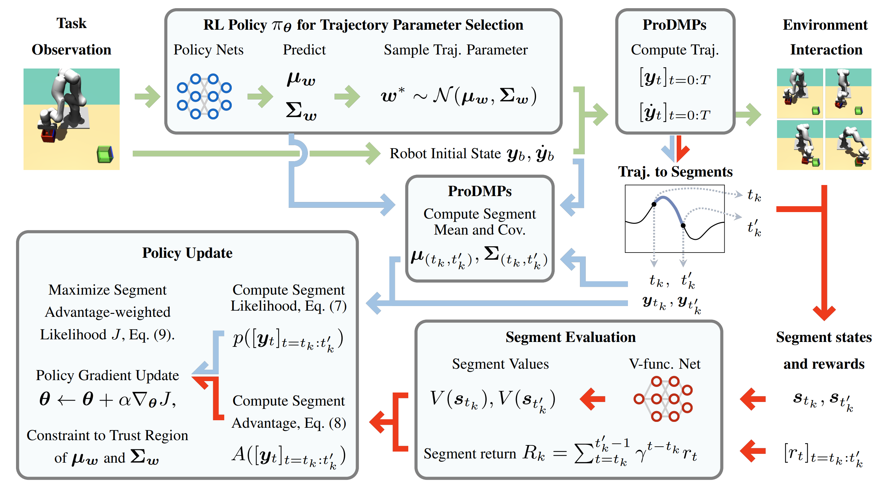

<p align="center">
  
  
  
</p>
<br><br>

## Abstract

Current advancements in reinforcement learning (RL) have predominantly focused
on learning step-based policies that generate actions for each perceived state.
While these methods efficiently leverage step information from environmental
interaction, they often ignore the temporal correlation between actions,
resulting in inefficient exploration and unsmooth trajectories that are
challenging to implement on real hardware. Episodic RL (ERL) seeks to overcome
these challenges by exploring in parameters space that capture the correlation
of actions. However, these approaches typically compromise data efficiency, as
they treat trajectories as opaque 'black boxes.' In this work, we introduce a
novel ERL algorithm, Temporally-Correlated Episodic RL (TCE), which effectively
utilizes step information in episodic policy updates, opening the 'black box' in
existing ERL methods while retaining the smooth and consistent exploration in
parameter space. TCE synergistically combines the advantages of step-based and
episodic RL, achieving comparable performance to recent ERL methods while
maintaining data efficiency akin to state-of-the-art (SoTA) step-based RL.

This work has been accepted by ICLR 2024.

## Framework

<br><br>

<!--- -->

## Installation
The installation of all packages is very tricky, I tried to make it as simple as possible.
I assume you are working on a linux machine with conda/mamba installed. 
If you are using a different OS, you need to adjust the installation commands accordingly.

First clone the repository to your local machine:
```
git clone -b main --single-branch git@github.com:BruceGeLi/TCE_RL.git
````

Then enter the repository and run the installation script:
```
cd TCE_RL
bash conda_env.sh
```
This will create a conda environment **tce** with all necessary packages installed. 
You can also take a look of the bash file and do the job step by step. The entire installation procedure will take about 15 min.

## Trouble Shooting
Again, the installation is very tricky, some known issues are listed below:
1. Cannot install or load the cppprojection package
    - This is a known issue, you can try to install the package manually by running the following command:
    ```
    conda uninstall -y cppprojection
    git clone git@github.com:ALRhub/ITPAL.git
    conda install -y conda-forge::liblapack=3.9.0
    conda install -y conda-forge::gcc_linux-64=12.2.0
    conda install -y conda-forge::armadillo=11.4.3
    conda install -y conda-forge::cmake=3.25.2
    conda install -y conda-forge::pybind11=2.10.3
    conda install -y conda-forge::nlopt=2.7.1
    conda install -y conda-forge::openblas=0.3.21
    cd ITPAL/cpp
    python setup.py install --user
    ```
   - Use mamba instead of conda here may lead to unsuccessful installation

2. Cannot use pytorch_cuda
   - We noticed for some HPC, the pytorch_cuda has conflicts with openblas which is a dependency of cpp_projection.
   - Please ensure that pytorch is installed after the package cpp_projection.

3. Very slow in solving dependencies
   - Except for the cpp_projection package, we recommend using mamba to install the rest conda packages.


## Quick Start
### Codebase Structure
The codebase is structured as follows:

    - configs: contains the configuration files for the experiments
    - evaluation: contains the scripts for the experiments evaluation and visualization
    - rl: contains the main code for the BBRL and TCE algorithms
    - util: contains the utility functions for the experiments
    - test: contains the test files for the codebase
    - mp_exp.py: the main entry point for the experiments
    - check_git_repos: a script to check the status of the all used git repositories
    - horeka_alias.sh: a script to create aliases for running the experiments. I offered these commands that were used in the Horeka HPC (Slurm based), so that you can adapt them for your own usage or Cluster.

### Git Repositories Version control
We use a small tool [Git_Repo_Tracker](https://github.com/ALRhub/Git_Repos_Tracker) to track the versions of the used git repositories (in editable mode). 
This will enforce all the changes in these git repos to be committed before running the experiments.
When running the experiments, all commit hashes of the used git repos will be saved in the experiment log and upload to wandb server. For example:
```
======= Run mode, enforce git repo commit checking. ========


************************************************************
*                Current repository status                 *
************************************************************


======================= mprl: Clean ========================

branch: tce_final
commit: e6fd671a91270c10f0550d74c918154f2cad1982

===================== fancy_gym: Clean =====================

branch: tce_final
commit: ccf50cf5f78100a267326b30b162de390282bf37

===================== metaworld: Clean =====================

branch: tce_final
commit: 5c80e3d2d4f62c8a46e8ea9aa5e8d4e298de2b26

============= trust_region_projections: Clean ==============

branch: TCE_ICLR24
commit: 9f33038b555af6c6d3d863b9c4bbe2ee314bbabe

================= git_repos_tracker: Clean =================

branch: main
commit: 8648da589b7c16fd452e33d5abf3ef77d6549474

************************************************************
*            End of checking repository status             *
************************************************************
```
In wandb artifacts, you can find the commit hashes of the used git repositories in the config.yaml:
```
git_repos:
  fancy_gym: 21282188ee3412b4098f8358a3ab2a5fefa9c67a
  git_repos_tracker: 8648da589b7c16fd452e33d5abf3ef77d6549474
  metaworld: 5c80e3d2d4f62c8a46e8ea9aa5e8d4e298de2b26
  mprl: 8ab95f31383417485971218d0ff914c50d18df1d
  trust_region_projections: 9f33038b555af6c6d3d863b9c4bbe2ee314bbabe
```

Given these commit numbers, we are able to reproduce the experiments and debug easily. 
However, if you run the code using a debugger, e.g. via PyCharm IDE, such an enforcement will not be activated.

You can enter the util_git.py to add or remove git repositories that to be tracked.

### Run or evaluate the experiments
To run the experiments, you need to run the main entry point `mp_exp.py` along with a config file and some options.
We use wandb for logging the experiment results, so you need to have a wandb account and adapt the WANDB_USERNAME in the experiment config files evaluation scripts. 
Using the example of the Metaworld experiments, you can run the experiments in you local machine:
```
cd mprl
python mp_exp.py ./config/metaworld/metaworld/tce/entire/local.yaml -o --nocodecopy
``` 
On a slurm based cluster, such as [Horeka](https://www.scc.kit.edu/en/services/horeka.php), the HPC we mainly used, you can use the following command:
```
cd mprl
python mp_exp.py ./config/metaworld/metaworld/tce/entire/horeka.yaml -o -s
```
The local.yaml and horeka.yaml are device specific configs, containing the info like resource assignment.
Both implicitly import the shared.yaml config file, which contains the device-agnostic HPs for the experiments.

To evaluate and visualize a trained model, such as a metaworld task, 
you can modify the evaluation script, given the model version and epoch number. Then run the following command (better in debug mode):
```
python evaluation/metaworld/tce.py 
```
You will receive some information if the git repos version mismatch (logged vs. current), so that you are aware of the potential issues.
```
************************************************************
*                 Git repos commits check                  *
************************************************************

{'mismatch_repo': 
[{'mprl_old': '8ab95f31383417485971218d0ff914c50d18df1d',
 'mprl_now': '2a0080c614062eede7e7be83344a29ebd40c1315'},
 {'fancy_gym_old': '21282188ee3412b4098f8358a3ab2a5fefa9c67a',
  'fancy_gym_now': 'ccf50cf5f78100a267326b30b162de390282bf37'}]}
```


We use the Clusterwork2 Package to manage the config files of the experiments. 
Please refer [cw2](https://github.com/ALRhub/cw2) for more details of the config hierarchy and options.


## Experiment Results in WandB
[Metaworld (TCE, BBRL)](https://api.wandb.ai/links/gelikit/ypzc58q1)

## Contact
If you have any questions, please feel free to contact me via email:
ge.li@kit.edu, geli.bruce.ai@gmail.com

I am glad to help you for any issues or questions :D

## Citation
Please consider citing our work if you find it useful or interesting:
```
@inproceedings{li2023open,
  title={Open the Black Box: Step-based Policy Updates for Temporally-Correlated Episodic Reinforcement Learning},
  author={Li, Ge and Zhou, Hongyi and Roth, Dominik and Thilges, Serge and Otto, Fabian and Lioutikov, Rudolf and Neumann, Gerhard},
  booktitle={The Twelfth International Conference on Learning Representations},
  year={2023}
}
```

Previous work for ProDMP:
```
@article{li2023prodmp,
  title={Prodmp: A unified perspective on dynamic and probabilistic movement primitives},
  author={Li, Ge and Jin, Zeqi and Volpp, Michael and Otto, Fabian and Lioutikov, Rudolf and Neumann, Gerhard},
  journal={IEEE Robotics and Automation Letters},
  volume={8},
  number={4},
  pages={2325--2332},
  year={2023},
  publisher={IEEE}
}
```